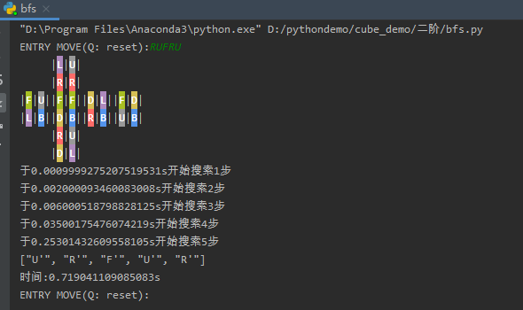
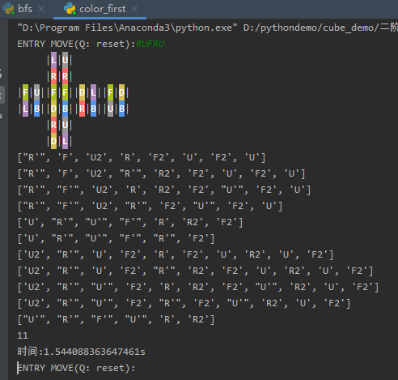

# 描述
最近想试着写三阶魔方的搜索算法，建立了三阶魔方的模型之后感觉直接搜索复杂度太高了，穷举的话5步就超过1s，每增加一步时间增加一个量级，于是先试试能不能实现二阶魔方的搜索。
    
# 参考

## 三阶魔方

### 三阶魔方模型

三阶魔方由十二个棱块八个角块六个中心组成，转动规则参考[WCA规则](https://www.worldcubeassociation.org/regulations/scrambles/)。
* 魔方状态: 用四个数组分别表示角块位置，角块方向，棱块位置，棱块方向。
* 转动规则: 剔除了整体转动与双层转动，每个方向三种转动，保留了18种转动

```
class cube:
    # 初始化魔方状态
    def __init__(self, e_place=[i for i in range(12)], e_status=[0 for i in range(12)], c_place=[i for i in range(8)], c_status=[0 for i in range(8)]):
        self.e_place = e_place
        self.e_status = e_status
        self.c_place = c_place
        self.c_status = c_status
        self.e_standard = [['U', 'F'], ['U', 'L'], ['U', 'B'], ['U', 'R'], ['D', 'F'], ['D', 'L'], ['D', 'B'],
                           ['D', 'R'], ['F', 'L'], ['B', 'L'], ['B', 'R'], ['F', 'R']]
        self.c_standard = [['U', 'F', 'L'], ['U', 'L', 'B'], ['U', 'B', 'R'], ['U', 'R', 'F'], ['D', 'L', 'F'],
                           ['D', 'B', 'L'], ['D', 'R', 'B'], ['D', 'F', 'R']]
        

```

## 二阶魔方

* 比起三阶魔方减少了中心块与棱块
* 六个方向中两两对称（相当于重复了）,去掉三个方向的转动，剩9种转动: R, R', R2, U, U', U2, F, F', F2

### 二阶魔方模型

```
class cube:
    def __init__(self, c_place=[i for i in range(8)], c_status=[0 for i in range(8)]):
        self.direction = ['U', 'L', 'F', 'R', 'B', 'D']
        self.c_place = c_place
        self.c_status = c_status
        self.c_standard = [['U', 'F', 'L'], ['U', 'L', 'B'], ['U', 'B', 'R'], ['U', 'R', 'F'], ['D', 'L', 'F'],
                           ['D', 'B', 'L'], ['D', 'R', 'B'], ['D', 'F', 'R']]
        self.color = ['white', 'orange', 'green', 'red', 'blue', 'yellow']
        self.move_map = {
            'U': self.U,
            'U2': self.U2,
            "U'": self.U3,
            'F': self.F,
            'F2': self.F2,
            "F'": self.F3,
            'R': self.R,
            'R2': self.R2,
            "R'": self.R3,
            "Q": self.reset,
        }
    
      
  
    # 每次转动改变魔方的状态，写成一个模板更好写，不过那样废步增多，略微有点影响性能，所以干脆直接穷举了。
    def U(self):
        self.c_place[0], self.c_place[1], self.c_place[2], self.c_place[3] = self.c_place[3], self.c_place[0], self.c_place[1], self.c_place[2]
        self.c_status[0], self.c_status[1], self.c_status[2], self.c_status[3] = self.c_status[3], self.c_status[0], self.c_status[1], self.c_status[2]
    def U2(self):
        self.c_place[0], self.c_place[1], self.c_place[2], self.c_place[3] = self.c_place[2], self.c_place[3], self.c_place[0], self.c_place[1]
        self.c_status[0], self.c_status[1], self.c_status[2], self.c_status[3] = self.c_status[2], self.c_status[3], self.c_status[0], self.c_status[1]
    def U3(self):
        self.c_place[0], self.c_place[1], self.c_place[2], self.c_place[3] = self.c_place[1], self.c_place[2], self.c_place[3], self.c_place[0]
        self.c_status[0], self.c_status[1], self.c_status[2], self.c_status[3] = self.c_status[1], self.c_status[2], self.c_status[3], self.c_status[0]
    def F(self):
        self.c_place[0], self.c_place[3], self.c_place[7], self.c_place[4] = self.c_place[4], self.c_place[0], self.c_place[3], self.c_place[7]
        self.c_status[0], self.c_status[3], self.c_status[7], self.c_status[4] = (self.c_status[4] + 2) % 3, (self.c_status[0] + 1) % 3, (self.c_status[3] + 2) % 3, (self.c_status[7] + 1) % 3
    def F2(self):
        self.c_place[0], self.c_place[3], self.c_place[7], self.c_place[4] = self.c_place[7], self.c_place[4], self.c_place[0], self.c_place[3]
        self.c_status[0], self.c_status[3], self.c_status[7], self.c_status[4] = self.c_status[7], self.c_status[4], self.c_status[0], self.c_status[3]
    def F3(self):
        self.c_place[0], self.c_place[3], self.c_place[7], self.c_place[4] = self.c_place[3], self.c_place[7], self.c_place[4], self.c_place[0]
        self.c_status[0], self.c_status[3], self.c_status[7], self.c_status[4] = (self.c_status[3] + 2) % 3, (self.c_status[7] + 1) % 3, (self.c_status[4] + 2) % 3, (self.c_status[0] + 1) % 3
    def R(self):
        self.c_place[3], self.c_place[2], self.c_place[6], self.c_place[7] = self.c_place[7], self.c_place[3], self.c_place[2], self.c_place[6]
        self.c_status[3], self.c_status[2], self.c_status[6], self.c_status[7] = (self.c_status[7] + 2) % 3, (self.c_status[3] + 1) % 3, (self.c_status[2] + 2) % 3, (self.c_status[6] + 1) % 3
    def R2(self):
        self.c_place[3], self.c_place[2], self.c_place[6], self.c_place[7] = self.c_place[6], self.c_place[7], self.c_place[3], self.c_place[2]
        self.c_status[3], self.c_status[2], self.c_status[6], self.c_status[7] = self.c_status[6], self.c_status[7], self.c_status[3], self.c_status[2]
    def R3(self):
        self.c_place[3], self.c_place[2], self.c_place[6], self.c_place[7] = self.c_place[2], self.c_place[6], self.c_place[7], self.c_place[3]
        self.c_status[3], self.c_status[2], self.c_status[6], self.c_status[7] = (self.c_status[2] + 2) % 3, (self.c_status[6] + 1) % 3, (self.c_status[7] + 2) % 3, (self.c_status[3] + 1) % 3
    
    
    
    # 转动一步
    def one_move(self, move):
        self.move_map[move]()
        
    # 省略了打印魔方，获取打乱步骤的方法
      
```


### 二阶魔方解法--BFS
一步到底的广度优先搜索，缺点和三阶一样，当步数超过7步时，搜索时间也基本在40s以外了
```
import cube2
import time
import copy

def solver():
    allow_moves = ["U", "U2", "U'", "R", "R2", "R'", "F", "F2", "F'"]
    step = 1
    while step < 12:
        print("于" + str(time.time() - start) + "s开始搜索" + str(step) + "步")
        moves = [0 for i in range(step)]
        while moves[0] < 9:
            flag = True
            for i in range(step - 1, 0, -1):
                if moves[i] // 3 == moves[i - 1] // 3:
                    flag = False
                    break
                if moves[i] == 9:
                    moves[i] = 0
                    moves[i - 1] += 1
            # print(moves)
            if flag and moves[0] < 9 and moves[-1] < 9:
                path = []
                for move in range(len(moves)):
                    path.append(allow_moves[moves[move]])
                    test.one_move(allow_moves[moves[move]])
                if test.is_all_finish():
                    return path
                else:
                    test.reset(c_place=copy.deepcopy(start_status[0]), c_status=copy.deepcopy(start_status[1]))
            moves[-1] += 1
        step += 1

test = cube2.cube()

# 暴力广度优先搜索
times = []
while True:
    get_input = input('ENTRY MOVE(Q: reset):')
    start = time.time()
    moves = test.get_moves(get_input)
    for single_move in moves:
        test.one_move(single_move)
    test.show_cube()

    start_status = copy.deepcopy([test.c_place, test.c_status])
    print(solver())
    end = time.time()
    print("时间:" + str(end - start) + "s")
    times.append(end - start)

```



试运行BFS，虽然很快得出了结果，但可以看出时间复杂度是指数级的。


### 二阶魔方解法--二阶段BFS

参考了二阶魔方速拧中的色先法，将搜索分为两步:
1.搜索角块朝向状态的还原
2.复原所有魔方，其中这一步限制一些会改变角块朝向状态的转动

```
import cube2
import time
import copy

def slover_status():
    allow_moves = ["U", "U2", "U'", "R", "R2", "R'", "F", "F2", "F'"]
    step = 1
    res = []
    while step < 12:
        # print("于" + str(time.time() - start) + "s开始搜索" + str(step) + "步")
        moves = [0 for i in range(step)]
        while moves[0] < 9:
            flag = True
            for i in range(step - 1, 0, -1):
                if moves[i] // 3 == moves[i - 1] // 3:
                    flag = False
                    break
                if moves[i] == 9:
                    moves[i] = 0
                    moves[i - 1] += 1
            if flag and moves[0] < 9 and moves[-1] < 9:
                path = []
                for move in range(len(moves)):
                    path.append(allow_moves[moves[move]])
                    test.one_move(allow_moves[moves[move]])
                if test.is_status_finish():
                    # test.show_cube()
                    res.append(path)
                else:
                    test.reset(c_place=copy.deepcopy(start_status[0]), c_status=copy.deepcopy(start_status[1]))
            moves[-1] += 1
            if len(res) > 30:
                return res
        step += 1

def slover_all():
    test.show_cube()
    start_status = copy.deepcopy([test.c_place, test.c_status])
    allow_moves = ["U", "U2", "U'", "R2", "F2"]
    step = 1
    this_start = time.time()
    while step < 16:
        # print("于"+str(time.time() - start)+"s开始搜索"+str(step)+"步")
        moves = [0 for i in range(step)]
        while moves[0] < 5:
            if time.time() - this_start > 10:
                return False
            flag = True
            for i in range(step - 1, 0, -1):
                if moves[i] < 3 and moves[i - 1] < 3:
                    moves[i] = 2
                    flag = False
                    break
                elif moves[i] == moves[i-1]:
                    flag = False
                    break
                if moves[i] > 4:
                    moves[i] = 0
                    moves[i - 1] += 1
            if flag and moves[0] < 5 and moves[-1] < 5:
                path = []
                for move in range(len(moves)):
                    path.append(allow_moves[moves[move]])
                    test.one_move(allow_moves[moves[move]])
                if test.is_all_finish():
                    test.show_cube()
                    return path
                else:
                    test.reset(c_place=copy.deepcopy(start_status[0]), c_status=copy.deepcopy(start_status[1]))
            moves[-1] += 1
        step += 1

test = cube2.cube()
# 二阶段搜索：参考色先法
times = []
while True:
    get_input = input('ENTRY MOVE(Q: reset):')
    start = time.time()
    moves = test.get_moves(get_input)
    for single_move in moves:
        test.one_move(single_move)
    test.show_cube()

    start_status = copy.deepcopy([test.c_place, test.c_status])
    res = slover_status()
    count = 0
    solvers = []
    for step1 in res:
        test.reset(c_place=copy.deepcopy(start_status[0]), c_status=copy.deepcopy(start_status[1]))
        for single_move in step1:
            test.one_move(single_move)
        res2 = slover_all()
        if res2:
            count += 1
            solvers.append(step1 + res2)
            print(step1 + res2)
        else:
            solvers.append(step1 + ['超过10秒'])
            print('太久了放弃')

    for solver in solvers:
        print(solver)
    # slove_all = slove_status + slover_all()
    # print(slove_all)
    end = time.time()
    print(count)
    print("时间:" + str(end - start) + "s")
    times.append(end - start)
```
如果采用多线程来搜索二阶段的话，有很大的概率会在1s内得出一个较短的路径



试运行二阶段BFS，结果：1.55秒内得到11个较短的结果，但没有最短的5步

# 总结
* 以上只是比较初级的两种思路，还有很大的优化空间，此外还有双向广度优先搜索以及IDA*的思路，等日后有空再试试。
* 遇到的坑: python中List在'='左边时是引用，而非申请一个新的内存空间，如果是要复制一个List，可以参考使用copy.deepcopy()
```
import copy
new_list = copy.deepcopy(old_list)
```